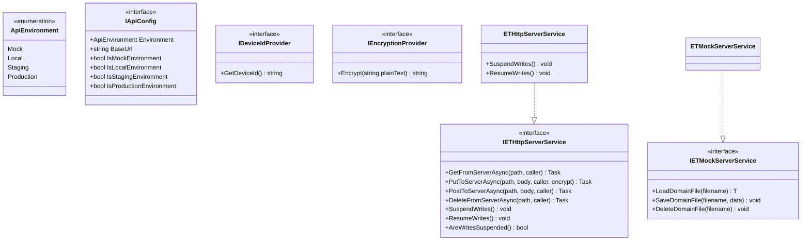

# ETServerSystem

`ETServerSystem` is a modular, extensible client-server communication subsystem designed for Unity. It provides abstract base classes, interfaces, and sample implementations to seamlessly switch between local offline simulations (Mock) and live network endpoints (Local, Staging, Production).

This document serves as the implementation specification and integration guide. It is designed to be fully context-complete so that any AI assistant or developer can read it and instantly implement or expand server service features within this codebase.

---

## Architecture Overview

The system architecture decouples the high-level game logic from the low-level transport layer by defining interfaces for configurations, encryption, device identifiers, and server services:



### Core Components

1. **`ApiEnvironment`**: Enum classifying the target backend environment (`Mock`, `Local`, `Staging`, `Production`).
2. **`IApiConfig`**: Specifies the target environment and provides the base URL. Often implemented as a Unity `ScriptableObject`.
3. **`IDeviceIdProvider`**: Standardizes client identification (passed via the `x-device-id` header).
4. **`IEncryptionProvider`**: Handles request payload encryption when secure transfers are requested.
5. **`ETHttpServerService`**: A base class wrapping `UnityWebRequest` in async tasks using `Newtonsoft.Json` for serialization.
6. **`ETMockServerService`**: A base class for offline development that persists data locally using JSON files stored in `Application.persistentDataPath`.

---

## How to Implement a New Service System

To implement `ETServerSystem` for your specific game or feature set (e.g., `IGameServerService`), follow these steps:

### Step 1: Define Your Data Models
Create serializable classes that represent the data structures exchanged with your backend.
```csharp
[System.Serializable]
public class GameStateData
{
    public int coins;
    public int tickets;
    public bool banned;
    // Keep it parameterless-constructible
}
```

### Step 2: Implement Config, Device ID, and Encryption Providers
Create concrete implementations of the utility interfaces:
```csharp
// 1. Device ID Provider
public class AppDeviceIdProvider : IDeviceIdProvider
{
    public string GetDeviceId() => SystemInfo.deviceUniqueIdentifier;
}

// 2. Encryption Provider (optional, returns raw/encrypted text)
public class AppEncryptionProvider : IEncryptionProvider
{
    public string Encrypt(string plainText) => MyCryptoLibrary.Encrypt(plainText);
}
```

Implement `IApiConfig` as a `ScriptableObject` to configure environments in the Unity Editor:
```csharp
[CreateAssetMenu(fileName = "ApiConfig", menuName = "Server/Api Config")]
public class ApiConfig : ScriptableObject, IApiConfig
{
    public ApiEnvironment environment;
    public string localUrl = "http://localhost:3000";
    public string stagingUrl = "https://staging.mygame.com";
    public string productionUrl = "https://mygame.com";

    public ApiEnvironment Environment => environment;
    public string BaseUrl => environment switch
    {
        ApiEnvironment.Staging => stagingUrl,
        ApiEnvironment.Production => productionUrl,
        _ => localUrl
    };

    public bool IsMockEnvironment => environment == ApiEnvironment.Mock;
    public bool IsLocalEnvironment => environment == ApiEnvironment.Local;
    public bool IsStagingEnvironment => environment == ApiEnvironment.Staging;
    public bool IsProductionEnvironment => environment == ApiEnvironment.Production;
}
```

### Step 3: Define the Game Server Service Interface
Create an interface containing all endpoints for your game state:
```csharp
public interface IGameServerService
{
    Task<GameStateData> LoadFullGameStateAsync();
    Task SaveFullGameStateAsync(GameStateData state);
}
```

### Step 4: Implement the Live Backend (HTTP)
Extend `ETHttpServerService` and implement your custom interface. Make use of the built-in HTTP helpers:
- `GetFromServerAsync<T>(path, caller)`
- `PutToServerAsync<T>(path, body, caller, encrypt)`
- `PostToServerAsync<TResponse, TRequest>(path, body, caller)`
- `DeleteFromServerAsync(path, caller)`

#### Critical Guard: Write Suspension
> [!IMPORTANT]
> If a network request during initial load fails, you **must** suspend subsequent saves. Otherwise, the client may initialize with an empty/default state and push/overwrite the server data, erasing the player's progress. Use the built-in `_writesSuspended = true` flag (or call `SuspendWrites()`).

```csharp
public class HttpServerService : ETHttpServerService, IGameServerService
{
    public HttpServerService(string baseUrl) 
        : base(baseUrl, new AppDeviceIdProvider(), new AppEncryptionProvider()) {}

    public async Task<GameStateData> LoadFullGameStateAsync()
    {
        try
        {
            // Call HTTP Get helper
            var state = await GetFromServerAsync<GameStateData>("game-state", nameof(LoadFullGameStateAsync));
            return state;
        }
        catch (System.Exception ex)
        {
            UnityEngine.Debug.LogError($"Load failed: {ex.Message}");
            // Critical: Suspend all writes to prevent wiping server-side state with a default empty layout
            SuspendWrites();
            return new GameStateData { loadFailed = true };
        }
    }

    public async Task SaveFullGameStateAsync(GameStateData state)
    {
        // Safe to call; the base PutToServerAsync will automatically discard the write if _writesSuspended is true
        await PutToServerAsync("game-state", state, nameof(SaveFullGameStateAsync), encrypt: true);
    }
}
```

### Step 5: Implement the Mock Backend (Offline)
Extend `ETMockServerService` and implement the same service interface. Use base helpers to save/load individual `.json` domain files inside the mock directory.
```csharp
public class MockServerService : ETMockServerService, IGameServerService
{
    private const string STATE_FILE = "gamestate.json";

    public MockServerService() : base("mock-server-directory") {}

    public Task<GameStateData> LoadFullGameStateAsync()
    {
        var data = LoadDomainFile<GameStateData>(STATE_FILE);
        return Task.FromResult(data);
    }

    public Task SaveFullGameStateAsync(GameStateData state)
    {
        SaveDomainFile(STATE_FILE, state);
        return Task.CompletedTask;
    }
}
```

### Step 6: Inject with Dependency Injection (DI)
Register the selected implementation based on your configuration. Here is an example of setting it up inside a DI Installer (e.g., VContainer's `LifetimeScope`):
```csharp
protected override void Configure(IContainerBuilder builder)
{
    var apiConfig = ApiConfig.Instance; // or reference serialized field

    if (apiConfig == null || apiConfig.IsMockEnvironment)
    {
        builder.Register<IGameServerService, MockServerService>(Lifetime.Scoped);
        UnityEngine.Debug.Log("[DI] Registered MockServerService.");
    }
    else
    {
        builder.Register<IGameServerService>(
            container => new HttpServerService(apiConfig.BaseUrl), 
            Lifetime.Scoped
        );
        UnityEngine.Debug.Log($"[DI] Registered HttpServerService at {apiConfig.BaseUrl}.");
    }
}
```

---

## Detailed Class & Interface Reference

### `ETHttpServerService` Methods
* `Task<T> GetFromServerAsync<T>(string path, string caller)`
  Sends a `GET` request to `BaseUrl/path`. Injects headers:
  - `x-device-id`: fetched from the configured `IDeviceIdProvider`.
  - Automatically yields using `Task.Yield()` until the UnityWebRequest completes.
  - Automatically logs an error on failure and returns a `new T()`.
* `Task PutToServerAsync<T>(string path, T body, string caller, bool encrypt)`
  Sends a `PUT` request with the JSON payload.
  - **Suspension check**: Aborts early if `AreWritesSuspended()` is true.
  - **Thread-safe**: Utilizes a `SemaphoreSlim` write lock internally.
  - **Encryption**: If `encrypt` is `true` and an `IEncryptionProvider` is configured, serializes the body, encrypts it, and wraps it in a `{ "data": "<encrypted_string>" }` JSON payload.
* `Task<TResponse> PostToServerAsync<TResponse, TRequest>(string path, TRequest body, string caller)`
  Sends a `POST` request to `BaseUrl/path` with a JSON request payload, yielding the deserialized JSON response.
* `Task DeleteFromServerAsync(string path, string caller)`
  Sends a `DELETE` request to `BaseUrl/path`.

### `ETMockServerService` Methods
* `T LoadDomainFile<T>(string filename)`
  Resolves the target path inside `Application.persistentDataPath/subFolder/filename`. If it exists, returns the deserialized JSON. Otherwise, returns a `new T()`.
* `void SaveDomainFile<T>(string filename, T data)`
  Serializes data to indented, loop-ignored JSON and saves/overwrites the target file.
* `void DeleteDomainFile(string filename)`
  Deletes the local simulation file if it exists.

---

## Instructions for AI Developers (Implementation Guidelines)
When asked to modify, extend, or build on top of implementations of `ETServerSystem` (e.g. `HttpServerService` or `MockServerService`):

1. **Double Implementation**: Every new endpoint or feature added to the interface (e.g. `IGameServerService`) **MUST** be implemented in BOTH the HTTP version (`HttpServerService.cs`) and the Mock version (`MockServerService.cs`).
2. **Mock Persistence**: Ensure each domain concept in the Mock backend reads/writes from its own dedicated JSON file (e.g. `currency.json`, `missions.json`) rather than keeping everything in memory. This ensures persistence across sessions.
3. **Serialization Compatibility**: Use standard properties and attributes that are easily serializable by `Newtonsoft.Json`. Ensure parameters have public getters/setters or are covered by appropriate serialization rules.
4. **Header Protocol**: All requests from `ETHttpServerService` require the `x-device-id` header. Do not bypass or omit it when extending base requests.
5. **Write Lock & Thread Safety**: Custom writes in the HTTP implementation should rely on `PutToServerAsync` or `PostToServerAsync` to utilize the internal write lock `SemaphoreSlim`, preserving sequence integrity.